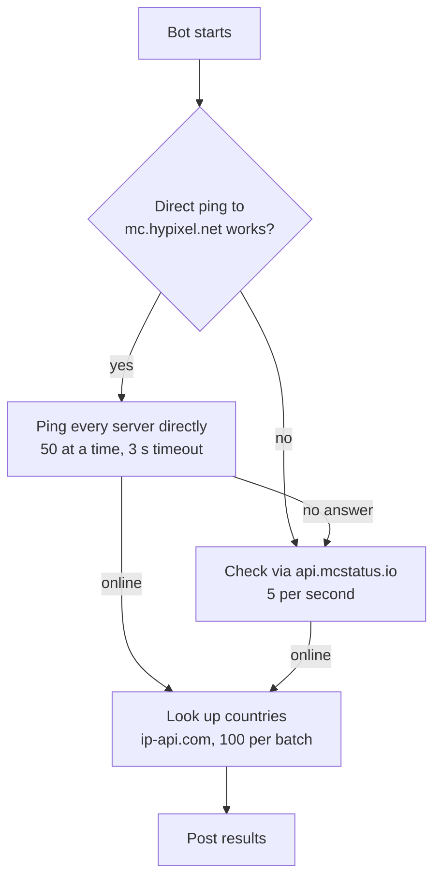

# Scanbot

A Discord bot that checks a list of Minecraft Java servers and tells you which ones are online, how many players they have, and where they are.

Drop a `.txt` file of IPs into Discord with `!scan`, watch the progress message count up, and get the results in chat or as a `.txt` / `.csv` file.

## Quick start

On any Linux machine with Docker, run this in the folder where you want the bot to live:

```bash
curl -fsSL https://raw.githubusercontent.com/TheDyXer/scanbot/main/install.sh | bash
```

It asks for your bot token, starts the bot, and keeps it updated automatically. Other options: [Docker Compose by hand](#docker-compose-by-hand) (also for Windows and macOS) or [without Docker](#without-docker).

First time? Create the Discord bot first; see [Discord bot setup](#discord-bot-setup). Skipping the **Message Content** switch is the most common reason the bot ignores commands.

## Contents

- [Features](#features)
- [Discord bot setup](#discord-bot-setup)
- [Installation](#installation)
  - [One-line installer](#one-line-installer)
  - [Docker Compose by hand](#docker-compose-by-hand)
  - [Automatic updates](#automatic-updates)
  - [Without Docker](#without-docker)
- [Usage](#usage)
- [How scanning works](#how-scanning-works)
- [Configuration](#configuration)
- [DNS: Quad9 over TLS](#dns-quad9-over-tls)
- [Keep it running without Docker (Linux)](#keep-it-running-without-docker-linux)
- [Troubleshooting](#troubleshooting)
- [Credits](#credits)

## Features

- **Fast scans:** pings servers directly, 50 at a time, and retries the ones that don't answer through `api.mcstatus.io`
- **Works on restricted networks:** if direct pings are blocked, the bot notices at startup and uses the API for everything
- **Live progress** in one message that updates itself
- **`!stop` at any point**, which posts what was found so far
- **Country flags** for every online server, including hostnames and `host:port` entries
- **Results as files** (`scan_results.txt`, `scan_results.csv`) when they don't fit in one message
- **Clean input:** blank lines, `#` comments, invalid entries and duplicates are skipped
- **Safe output:** server MOTDs and player names can't `@mention` anyone or break formatting
- **Private DNS:** every lookup goes to Quad9 over DNS-over-TLS
- One scan at a time, up to 5,000 IPs per scan
- **Docker image** for `amd64` and `arm64`, a one-line installer, and automatic daily updates

## Discord bot setup

1. Go to the [Discord Developer Portal](https://discord.com/developers/applications) and click **New Application**.
2. Open **Bot**:
   - Click **Reset Token** and copy the token. You'll need it for `DISCORD_TOKEN`.
   - Under **Privileged Gateway Intents**, turn on **Message Content Intent**. Without it the bot logs in but never sees `!scan`.
3. Invite the bot to your server. Replace `<CLIENT_ID>` with the **Application ID** from **General Information**:

   ```
   https://discord.com/oauth2/authorize?client_id=<CLIENT_ID>&scope=bot&permissions=52224
   ```

   `52224` grants only what the bot uses:

   | Permission | Used for |
   | --- | --- |
   | View Channels | Seeing the command |
   | Send Messages | Replies and the progress message |
   | Embed Links | `!help` |
   | Attach Files | `scan_results.txt` / `.csv` |

Commands also work in a direct message to the bot.

## Installation

Docker is the easiest way: one command installs the bot, and it updates itself. The image runs on `amd64` and `arm64` (for example a Raspberry Pi 4 or 5).

### One-line installer

Needs Docker with the Compose plugin ([install Docker](https://docs.docker.com/engine/install/)). Run this in the folder where you want the bot to live:

```bash
curl -fsSL https://raw.githubusercontent.com/TheDyXer/scanbot/main/install.sh | bash
```

The installer:

1. Creates a `scanbot` folder with the compose file and a `data` folder next to it:

   ```text
   scanbot/
   ├── docker-compose.yml
   ├── .env              # settings: user ID, time zone
   └── data/
       └── token.txt     # your bot token
   ```

2. Asks for your bot token (hidden while you type) and saves it to `data/token.txt`, readable only by you.
3. Starts the bot, waits until it has logged in to Discord, and tells you if the token was rejected.

Running it again is safe: it keeps your files and pulls the latest version. To skip the question, pass the token in: `curl -fsSL … | DISCORD_TOKEN=your-token bash`. To use a different folder name, set `SCANBOT_DIR`.

### Docker Compose by hand

This works everywhere Docker does, including Docker Desktop on Windows and macOS:

1. Make a folder and download [`docker-compose.yml`](docker-compose.yml) into it.
2. Create a `data` folder next to it and put your token in `data/token.txt`.
3. Start it:

   ```bash
   docker compose up -d
   ```

Instead of `token.txt` you can set `DISCORD_TOKEN=your-token` in a `.env` file next to `docker-compose.yml`.

On Linux the bot runs as user `1000` by default. If your user ID is different (check with `id -u`), add `SCANBOT_UID=<your uid>` and `SCANBOT_GID=<your gid>` to `.env`, or the bot can't read `token.txt`. The installer does this for you.

Everyday commands, run in the folder with `docker-compose.yml`:

| Command | What it does |
| --- | --- |
| `docker compose logs -f scanbot` | Follow the bot's log |
| `docker compose restart scanbot` | Restart the bot, for example after changing the token |
| `docker compose pull && docker compose up -d` | Update now |
| `docker compose down` | Stop the bot |

To uninstall, run `docker compose down --rmi all` and delete the folder.

### Automatic updates

The compose file includes [Watchtower](https://github.com/nicholas-fedor/watchtower), which checks for a new scanbot image **every day at 4 AM** and restarts the bot on the new version if there is one.

- It only touches scanbot, never your other containers.
- The time zone is `TZ` in `.env` (default `UTC`), for example `TZ=Europe/Budapest`.
- The image is also rebuilt weekly for security fixes, so expect a restart about once a week even without new features.
- Watchtower needs access to the Docker socket to restart the bot.

**Already run Watchtower on this machine?** Delete the `watchtower:` block from `docker-compose.yml`. The scanbot container has the `com.centurylinklabs.watchtower.enable=true` label, so your existing Watchtower updates it. Keeping both can make an older Watchtower stop the new one.

**Don't want automatic updates?** Delete the `watchtower:` block and update with `docker compose pull && docker compose up -d` when you like.

### Without Docker

Requires **Python 3.10+**.

```bash
git clone https://github.com/TheDyXer/scanbot.git
cd scanbot
pip install -r requirements.txt
```

Give the bot its token in one of two ways:

- **Environment variable (recommended):** set `DISCORD_TOKEN`.
- **File:** create `token.txt` next to `bot.py` containing only the token. It's already in `.gitignore`.

Then run:

```bash
python bot.py
```

To keep it running and start it at boot, see [Keep it running without Docker](#keep-it-running-without-docker-linux).

### Startup log

The log (`docker compose logs scanbot`, or the terminal without Docker) says which scan mode you're in:

```
[2026-01-01 12:00:00] [INFO    ] scanbot: Direct pings work; scans use direct pings with API fallback.
```

or, if your network blocks Minecraft's port:

```
[2026-01-01 12:00:00] [WARNING ] scanbot: Direct ping to mc.hypixel.net failed; scans use the mcstatus.io API only (5 checks/second).
```

## Usage

| Command | What it does |
| --- | --- |
| `!scan` (or `!check`) + attached `.txt` | Scans every server in the file |
| `!stop` | Stops the running scan and posts what it found so far |
| `!help` | Lists the commands |

### The IP list

One server per line, as an IP, a hostname, or either with a port:

```text
# comments and blank lines are ignored
1.2.3.4
1.2.3.4:25570
play.example.com
play.example.com:25566
```

- Up to **5,000** servers per scan
- Duplicates and invalid lines are skipped, and the start message tells you how many
- IPv6 addresses aren't supported
- Only the first attachment on the message is read

### What you'll see

The start message, then a progress message that updates every 3 seconds:

```text
🚀 Scan started on 4 IPs (skipped 1 invalid line(s), removed 1 duplicate(s))...
🔎 Retrying unreachable servers via API: 1/2 · Found: 2
```

Then the results, sorted by player count. Example from a test run:

```text
📊 Scan Complete!
🟢 2 with players · ⚪ 1 empty · 🔎 4 IPs
⏱️ Time: 0m 4s
⚡ Speed: 0.82 IPs/sec

🟢 Servers with Players (2):
🇨🇦 mc.hypixel.net | Players: 21893/200000 | Ver: Requires MC 1.8 / 1.21
   └ 📝 Hypixel Network [1.8/26.3]  SKYBLOCK 0.27.1 TORRHUS & SAFARI
…
```

If the results don't fit in one Discord message, you get the summary and the top 10 servers in chat, with the full list attached:

- `scan_results.txt`: the same report as plain text
- `scan_results.csv`: one row per online server with the columns `ip, resolved_ip, country, players_online, players_max, version, motd, players`

## How scanning works



1. **Direct pings.** When the bot starts it pings `mc.hypixel.net`. If that works, scans ping each server directly, 50 at a time, waiting up to 3 seconds each. That covers 5,000 IPs in at most about 5 minutes.
2. **API fallback.** Servers that don't answer a direct ping are retried through `api.mcstatus.io`, which allows 5 requests per second, so lists with many dead IPs still take a while. If the startup ping failed, every server goes through the API, and 5,000 IPs take about 17 minutes.
3. **Countries.** Online servers are looked up on `ip-api.com` in batches of 100, 4 seconds apart to stay under its limit of 15 requests per minute.

`!stop` works in every phase. Pings already in flight finish (at most 3 seconds), and nothing new starts.

## Configuration

Settings are at the top of `bot.py`:

| Setting | Default | What it does |
| --- | --- | --- |
| `MAX_IPS_PER_SCAN` | `5000` | Largest list the bot accepts |
| `DIRECT_CONCURRENCY` | `50` | Direct pings running at the same time |
| `DIRECT_TIMEOUT` | `3` | Seconds to wait for a server to answer a direct ping |
| `API_DELAY` | `0.2` | Seconds between API requests (mcstatus.io allows 5/second) |
| `GEO_DELAY` | `4` | Seconds between ip-api.com batches (15/minute allowed) |
| `PROBE_SERVER` | `mc.hypixel.net` | Server pinged at startup to test direct pings |
| `PROGRESS_INTERVAL` | `3` | Seconds between progress message updates |
| `INLINE_LIMIT` | `1900` | Results longer than this many characters are sent as files |

Lowering `API_DELAY` or `GEO_DELAY` below the services' limits gets the bot rate-limited, which makes scans slower, not faster.

## DNS: Quad9 over TLS

Every hostname the bot looks up goes to [Quad9](https://quad9.net) over DNS-over-TLS (port 853), with 9.9.9.9 as primary and 149.112.112.112 as backup. That includes Discord, the APIs, and the servers in your list. Your system DNS isn't used.

Check that port 853 works from the machine running the bot:

```bash
openssl s_client -connect 9.9.9.9:853 -servername dns.quad9.net </dev/null 2>/dev/null | grep "Verify return code"
# Verify return code: 0 (ok)   ← DoT works
```

On Windows: `Test-NetConnection 9.9.9.9 -Port 853` should show `TcpTestSucceeded : True`.

**If port 853 is blocked**, switch to DNS-over-HTTPS, which uses port 443 like normal web traffic:

1. `pip install httpx`
2. In `bot.py`, replace the two `DoTNameserver(...)` lines with:

   ```python
   dns.nameserver.DoHNameserver('https://dns.quad9.net/dns-query', bootstrap_address='9.9.9.9'),
   ```

With Docker, that means building your own image: make the change in a clone, add `httpx` to `requirements.txt`, run `docker build -t scanbot-doh .`, set `SCANBOT_IMAGE=scanbot-doh` in `.env`, and delete the `watchtower:` block (it can only update published images).

## Keep it running without Docker (Linux)

With Docker this is already handled: the bot restarts on crashes and at boot. Without Docker, a systemd service restarts the bot if it crashes and starts it at boot. It assumes the bot lives in `/opt/scanbot` and runs as a user called `scanbot`; adjust to taste.

`/etc/scanbot.env` (readable only by root, `chmod 600`):

```ini
DISCORD_TOKEN=your-bot-token
```

`/etc/systemd/system/scanbot.service`:

```ini
[Unit]
Description=Scanbot Discord bot
After=network-online.target
Wants=network-online.target

[Service]
User=scanbot
WorkingDirectory=/opt/scanbot
EnvironmentFile=/etc/scanbot.env
ExecStart=/usr/bin/python3 /opt/scanbot/bot.py
Restart=on-failure
RestartSec=10

[Install]
WantedBy=multi-user.target
```

```bash
sudo systemctl daemon-reload
sudo systemctl enable --now scanbot
journalctl -u scanbot -f    # follow the log
```

If you installed the packages in a virtual environment, point `ExecStart` at its Python, for example `/opt/scanbot/venv/bin/python`.

## Troubleshooting

| Symptom | Cause | Fix |
| --- | --- | --- |
| Bot is online but ignores `!scan` | Message Content Intent is off | Turn it on in the Developer Portal → **Bot** → **Privileged Gateway Intents**, then restart the bot |
| Installer says `The scanbot image isn't public yet` | The image on GitHub's registry is still private | Repo owner: open the package's settings and set visibility to **Public** |
| `Error: can't read /data/token.txt: Permission denied` | The container runs as a different user than the owner of `token.txt` | Put `SCANBOT_UID` and `SCANBOT_GID` in `.env` (from `id -u` and `id -g`), then `docker compose up -d` |
| `Error: no Discord token` | `data/token.txt` is missing or empty, and `DISCORD_TOKEN` isn't set | Put the token in `data/token.txt`, then `docker compose up -d` |
| Bot doesn't update itself | The `watchtower:` block was removed, or another Watchtower stopped it | `docker compose logs watchtower`; see [Automatic updates](#automatic-updates) |
| `Direct ping to mc.hypixel.net failed` at startup | Your network blocks outbound port 25565 | Nothing to fix: scans use the API instead (5 servers/second). Run the bot on another network for full speed |
| Bot fails to log in with a DNS error | Port 853 (DNS-over-TLS) is blocked | [Switch to DNS-over-HTTPS](#dns-quad9-over-tls) |
| `Improper token has been passed` | Wrong or reset token | Copy a fresh token from the Developer Portal |
| `⏳ Bot is busy` | Another scan is running | Wait, or `!stop` it |
| `⚠️ No valid IPs in the file` | Every line was blank, a comment, or not an address | One IP or hostname per line; IPv6 isn't supported |
| Servers show 🏳️ instead of a flag | ip-api.com was unreachable or rate-limited | Wait a minute and scan again; it allows 15 batches per minute |
| Many known-online servers missing | mcstatus.io rate-limited the bot | Don't run other tools using the API from the same IP; leave `API_DELAY` at `0.2` or higher |

## Credits

- [discord.py](https://github.com/Rapptz/discord.py): Discord API wrapper
- [mcstatus](https://github.com/py-mine/mcstatus): direct Minecraft server pings
- [mcstatus.io](https://mcstatus.io): server status API (5 requests/second per IP)
- [ip-api.com](https://ip-api.com): IP geolocation. The free batch endpoint is HTTP-only, limited to 15 requests per minute, and [not for commercial use](https://ip-api.com/docs/api:batch)
- [dnspython](https://www.dnspython.org) and [Quad9](https://quad9.net): encrypted DNS
