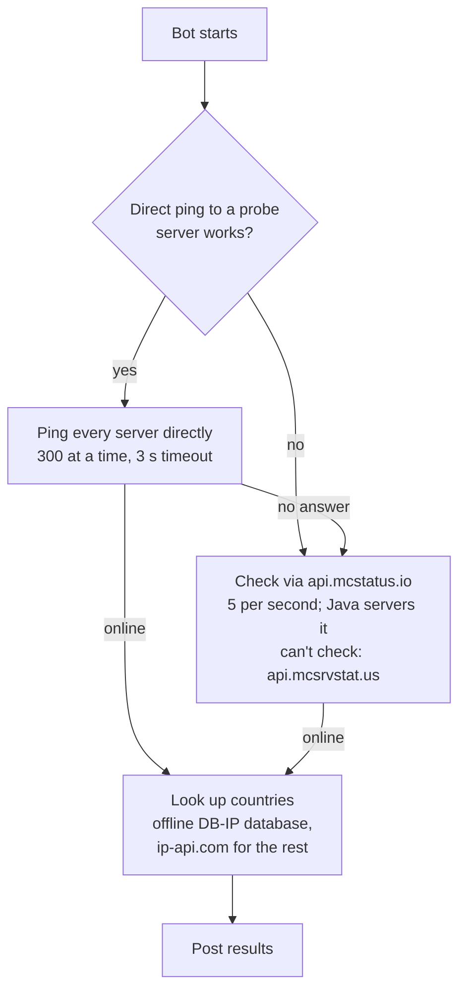

# Scanbot

A Discord bot that checks a list of Minecraft servers (Java or Bedrock Edition) and tells you which ones are online, how many players they have, and where they are.

Drop a `.txt` file of IPs into Discord with `/scan` (or `!scan`), watch the progress message count up, and get the results in chat or as a `.txt` / `.csv` file.

## Quick start

On any Linux machine with Docker, run this in the folder where you want the bot to live:

```bash
curl -fsSL https://raw.githubusercontent.com/TheDyXer/scanbot/main/install.sh | bash
```

It asks for your bot token, starts the bot, and keeps it updated automatically.

If it stops with `Your user can't talk to Docker` (Docker says "permission denied"), your account isn't allowed to use Docker. Run the same thing with `sudo`:

```bash
curl -fsSL https://raw.githubusercontent.com/TheDyXer/scanbot/main/install.sh | sudo bash
```

With `sudo`, the files still belong to you and the bot runs as your user, not as root. Docker itself still needs root or the `docker` group, the same reason the first command failed, so later `docker compose` commands in that folder need `sudo` too; the installer prints them that way. To avoid that, run `sudo usermod -aG docker $USER` once, log out and back in, and use the first command instead.

Other options: [Docker Compose by hand](#docker-compose-by-hand) (also for Windows and macOS) or [without Docker](#without-docker).

First time? Create the Discord bot first; see [Discord bot setup](#discord-bot-setup). Skipping the **Message Content** switch is the most common reason the bot ignores `!` commands. The slash commands (`/scan`) don't need it.

## Contents

- [Features](#features)
- [Discord bot setup](#discord-bot-setup)
- [Installation](#installation)
  - [One-line installer](#one-line-installer)
  - [Docker Compose by hand](#docker-compose-by-hand)
  - [Automatic updates](#automatic-updates)
  - [Without Docker](#without-docker)
- [Usage](#usage)
- [How scanning works](#how-scanning-works)
- [Configuration](#configuration)
- [DNS: Quad9 over TLS](#dns-quad9-over-tls)
- [VPN](#vpn)
- [Keep it running without Docker (Linux)](#keep-it-running-without-docker-linux)
- [Troubleshooting](#troubleshooting)
- [Credits](#credits)
- [License](#license)

## Features

- **Java and Bedrock Edition:** `/scan file:<.txt> edition:bedrock` checks Bedrock servers the same way
- **Ranges, networks and whole ISPs:** list lines like `1.2.3.0/24`, `1.2.3.10-1.2.3.20` or `1.2.3.*`, or no file at all: `/scan target:asn:AS8400`, `target:country:RS` or `target:cidr:1.2.3.0/24` (AS and country address lists come from RIPEstat)
- **Campaigns:** a list or target bigger than one scan (up to 2,000,000 addresses) runs in parts of 30,000, one after another, with one result at the end. The bot first says how long it may take, and starts it when you confirm (see [Campaigns](#campaigns))
- **Rescan and diff:** `/rescan` checks again the servers your last scan found online; `/diff` compares your last two scans: new servers, gone ones and player changes
- **Fast scans:** pings servers directly, 300 at a time, and retries the ones that don't answer through `api.mcstatus.io`, with `api.mcsrvstat.us` as a second opinion for Java servers when mcstatus.io can't answer
- **Skip the retry when it isn't worth it:** `/scan file:<.txt> api:off` counts only servers that answer a direct ping, which is much faster for long lists of mostly dead addresses (see [Skipping the API retry](#skipping-the-api-retry))
- **Works on restricted networks:** if direct pings are blocked, the bot notices at startup and uses the API for everything
- **Live progress** in one message that updates itself
- **Slash commands** (`/scan`, `/stop`, `/help`) and the older `!scan`, `!stop`, `!help`; both do the same thing
- **Several people can scan at once:** up to 5 scans run side by side, one per person, and more wait in a queue
- **`/stop` at any point**, which posts what was found so far. It stops your own scan; moderators can stop anyone's
- **Survives restarts:** a scan is saved as it runs, so an update, a crash or a reboot pauses it, and it carries on where it left off once the bot is back
- **Country flags** for every online server, including hostnames and `host:port` entries, from an offline database: instant, no rate limits, and server IPs stay on your machine (only the few the database doesn't know are looked up at ip-api.com)
- **Results as files** (`scan_results.txt`, `scan_results.csv`, `scan_results.json`) when they don't fit in one message. A huge scan's files are split to fit Discord's upload limit and arrive as several messages
- **More than player counts** in the files: each server's network (AS number and name, from a second offline database), latency, protocol, software, plugins, Forge mods, secure chat, and Bedrock's game mode and map, as far as the server tells
- **Clean input:** blank lines, `#` comments, invalid entries and duplicates are skipped
- **Public servers only:** private and local addresses (`127.0.0.1`, `192.168.x.x`, `localhost`, ...) are never contacted, so nobody can use the bot to probe the network it runs on
- **Safe output:** server MOTDs and player names can't `@mention` anyone or break formatting
- **Private DNS:** every lookup goes to Quad9 over DNS-over-TLS, or DNS-over-HTTPS where port 853 is blocked
- Up to 30,000 IPs per scan, and 2,000,000 in a campaign
- **Docker image** for `amd64` and `arm64`, a one-line installer, and automatic daily updates

## Discord bot setup

1. Go to the [Discord Developer Portal](https://discord.com/developers/applications) and click **New Application**.
2. Open **Bot**:
   - Click **Reset Token** and copy the token. You'll need it for `DISCORD_TOKEN`.
   - Under **Privileged Gateway Intents**, turn on **Message Content Intent** if you want the `!` commands. Without it the bot logs in but never sees `!scan`. Slash commands don't need it: set `SLASH_ONLY=1` to run without that intent (see [Configuration](#configuration)).
3. Invite the bot to your server. Replace `<CLIENT_ID>` with the **Application ID** from **General Information**:

   ```
   https://discord.com/oauth2/authorize?client_id=<CLIENT_ID>&scope=bot&permissions=52224
   ```

   `52224` grants only what the bot uses:

   | Permission | Used for |
   | --- | --- |
   | View Channels | Seeing the command |
   | Send Messages | Replies and the progress message |
   | Embed Links | `!help` |
   | Attach Files | `scan_results.txt` / `.csv` / `.json` |

Commands also work in a direct message to the bot.

The `bot` scope already includes `applications.commands`, so the slash commands appear once the bot has started and synced them. If `/scan` doesn't show up, wait a minute and restart Discord (Ctrl+R).

## Installation

Docker is the easiest way: one command installs the bot, and it updates itself. The image runs on `amd64` and `arm64` (for example a Raspberry Pi 4 or 5).

### One-line installer

Needs Docker with the Compose plugin ([install Docker](https://docs.docker.com/engine/install/)). Run this in the folder where you want the bot to live:

```bash
curl -fsSL https://raw.githubusercontent.com/TheDyXer/scanbot/main/install.sh | bash
```

If it says `Your user can't talk to Docker`, use the `sudo` version instead (see [the note in Quick start](#quick-start) about what that changes):

```bash
curl -fsSL https://raw.githubusercontent.com/TheDyXer/scanbot/main/install.sh | sudo bash
```

The installer:

1. Creates a `scanbot` folder with the compose file, a `data` folder and a `state` folder next to it:

   ```text
   scanbot/
   ├── docker-compose.yml
   ├── .env              # settings: user ID, time zone
   ├── data/
   │   └── token.txt     # your bot token
   └── state/            # running and recent scans, so a restart resumes them
   ```

2. Asks for your bot token (hidden while you type) and saves it to `data/token.txt`, readable only by you.
3. Starts the bot, waits until it has logged in to Discord, and tells you if the token was rejected.

Running it again is safe: it keeps your files and pulls the latest version. It also brings `docker-compose.yml` up to date, unless you changed it: the old copy is kept as `docker-compose.yml.bak`, and a file you edited is left alone (the installer tells you a newer one exists). Deleting the `watchtower:` block, as described in [Automatic updates](#automatic-updates), doesn't count as a change: the updated file leaves it out too.

**A new token:** run it again with `--token`. It asks for the new one (hidden; Enter keeps the current one), saves it and restarts the bot:

```bash
curl -fsSL https://raw.githubusercontent.com/TheDyXer/scanbot/main/install.sh | bash -s -- --token
```

**Installed with `sudo` by an older installer?** Then the bot runs as root. Run the installer again with `sudo`: it moves the bot to your user and gives you the files.

**Answers in advance:** these variables answer the installer's questions, for example `curl -fsSL … | SCANBOT_VPN=warp bash`. With `sudo`, put them after it: `… | sudo SCANBOT_VPN=warp bash`.

| Variable | What it does |
| --- | --- |
| `DISCORD_TOKEN` | The bot token, instead of being asked. It replaces a saved one. With `sudo`, answer the prompt instead: a token on `sudo`'s command line shows up in `ps` and in sudo's log |
| `SCANBOT_DIR` | The install folder (default `scanbot`) |
| `SCANBOT_REF` | The branch or tag to download the compose files from (default `main`) |
| `SCANBOT_IMAGE` | The image to run instead of `ghcr.io/thedyxer/scanbot:latest` |
| `SCANBOT_VPN` | `none`, `mullvad`, `protonvpn` or `warp`: the VPN, without being asked |
| `SCANBOT_VPN_FREE` | `yes` or `no`: whether your Proton account is on the free plan |
| `SCANBOT_VPN_CITY` | The VPN city by name, like `Belgrade` or `Paris, France`; skips the ping test |
| `WIREGUARD_PRIVATE_KEY`, `WIREGUARD_ADDRESSES` | The VPN key and address, instead of being asked |

`GLUETUN_IMAGE` in `.env` picks another gluetun image (default `qmcgaw/gluetun:v3`).

### Docker Compose by hand

This works everywhere Docker does, including Docker Desktop on Windows and macOS:

1. Make a folder and download [`docker-compose.yml`](docker-compose.yml) into it.
2. Create `data` and `state` folders next to it and put your token in `data/token.txt`. The bot saves its scans in `state`, so it must be able to write there: on Linux, give it to user `1000` (`sudo chown 1000:1000 state`), or to your `SCANBOT_UID` (see below). Without that the bot still works, but a restart ends running scans.
3. Start it:

   ```bash
   docker compose up -d
   ```

Instead of `token.txt` you can set `DISCORD_TOKEN=your-token` in a `.env` file next to `docker-compose.yml`.

On Linux the bot runs as user `1000` by default. If your user ID is different (check with `id -u`), add `SCANBOT_UID=<your uid>` and `SCANBOT_GID=<your gid>` to `.env`, or the bot can't read `token.txt`. The installer does this for you.

Everyday commands, run in the folder with `docker-compose.yml`:

| Command | What it does |
| --- | --- |
| `docker compose logs -f scanbot` | Follow the bot's log |
| `docker compose restart scanbot` | Restart the bot, for example after changing the token |
| `docker compose pull && docker compose up -d` | Update now |
| `docker compose down` | Stop the bot |

To uninstall, run `docker compose down --rmi all` and delete the folder.

### Automatic updates

The compose file includes [Watchtower](https://github.com/nicholas-fedor/watchtower), which checks for a new scanbot image **every day at 4 AM** and restarts the bot on the new version if there is one. A scan that is running at that moment is paused and carries on once the bot is back, usually within a minute; queued scans keep their place (see [Restarts and updates](#restarts-and-updates)).

- It only touches scanbot, never your other containers.
- The time zone is `TZ` in `.env` (default `UTC`), for example `TZ=Europe/Budapest`. It's also the time zone of the bot's log.
- The image is also rebuilt weekly for security fixes, so expect a restart about once a week even without new features.
- Watchtower needs access to the Docker socket to restart the bot.
- Docker gives the bot 45 seconds to save running scans, or to post what they found when it can't save them (`stop_grace_period` in `docker-compose.yml`), and so does this Watchtower. The same happens on `docker compose stop`, `restart` or `down`. If your own Watchtower updates scanbot instead, note that the original `containrrr/watchtower` waits only 10 seconds: start it with `--stop-timeout 45s`.
- Watchtower updates the bot, not `docker-compose.yml`. When a new version needs a changed compose file (a new setting, for example), run the [installer](#one-line-installer) again: it updates the file for you.

**Already run Watchtower on this machine?** Delete the `watchtower:` block from `docker-compose.yml`. The scanbot container has the `com.centurylinklabs.watchtower.enable=true` label, so your existing Watchtower updates it. Keeping both can make an older Watchtower stop the new one. When the installer updates `docker-compose.yml`, it leaves the block out again.

**Don't want automatic updates?** Delete the `watchtower:` block and update with `docker compose pull && docker compose up -d` when you like.

### Without Docker

Requires **Python 3.10+** (the tests run on 3.10 and 3.13 in CI).

```bash
git clone https://github.com/TheDyXer/scanbot.git
cd scanbot
pip install -r requirements.txt
```

Give the bot its token in one of two ways:

- **Environment variable (recommended):** set `DISCORD_TOKEN`.
- **File:** create `token.txt` next to `bot.py` containing only the token. It's already in `.gitignore`.

Then run:

```bash
python bot.py
```

Scans are saved in a `state` folder next to `bot.py`, so a restart resumes them; set `STATE_DIR` to put them elsewhere. To keep it running and start it at boot, see [Keep it running without Docker](#keep-it-running-without-docker-linux).

### Startup log

The log (`docker compose logs scanbot`, or the terminal without Docker) says which scan mode you're in:

```
[2026-01-01 12:00:00] [INFO    ] scanbot: Direct pings work; scans use direct pings with API fallback.
```

Before that, it shows the direct ping and API settings (see [Configuration](#configuration)):

```
[2026-01-01 12:00:00] [INFO    ] scanbot: Direct pings: up to 300 per scan (600 for all scans together), 3 s timeout
[2026-01-01 12:00:00] [INFO    ] scanbot: API checks: mcstatus.io every 0.2 s (query on, 3 s server timeout); Java servers it can't check go to mcsrvstat.us, every 0.5 s
```

or, if your network blocks Minecraft's port:

```
[2026-01-01 12:00:00] [WARNING ] scanbot: Direct pings to demo.mcstatus.io, play.cubecraft.net, play.wynncraft.com all failed; scans use the mcstatus.io API only (5 checks/second).
```

## Usage

| Command | What it does |
| --- | --- |
| `/scan file:<.txt> [edition] [api] [confirm]` (or `!scan [edition] [api] [yes]` + attached `.txt`; `!check` works too) | Scans every server in the file. `edition` is `java` (the default) or `bedrock`, and applies to the whole file. `api` is `on`, `off` or `auto` (the default: on for a scan, off for a campaign): [skip the API retry](#skipping-the-api-retry), as in `!scan java off`. `confirm:yes` starts a [campaign](#campaigns) |
| `/scan target:<target> [edition] [api] [confirm]` (or `!scan <target> [edition] [api] [yes]`, no file) | Scans an AS number's, a country's or a range's addresses instead of a file: `asn:AS8400`, `country:RS` or `cidr:1.2.3.0/24` (a range or wildcard works too). See [Scanning without a file](#scanning-without-a-file) |
| `/rescan [edition] [api]` (or `!rescan [edition] [api]`) | Checks again the servers your last finished scan found online (your last one of that edition, if you give one). `api` defaults to what that scan used. See [Rescan and diff](#rescan-and-diff) |
| `/diff` (or `!diff`) | Compares your last two finished scans of the same edition: new servers, gone ones, and changed player counts, with a `diff.csv` |
| `/stop` (or `!stop`) | Stops your scan and posts what it found so far, or cancels it if it's still queued |
| `/stop user:@name` (or `!stop @name`) | Moderators: stops that person's scan |
| `/stop all:all` (or `!stop all`) | Moderators: stops every scan in this server |
| `/help` (or `!help`) | Lists the commands |

Progress and results are posted as normal messages in the channel, not as replies to the slash command: Discord stops accepting replies to a slash command after 15 minutes, and a big scan can take longer. The bot needs **Send Messages** in that channel, otherwise it falls back to replying.

### Several people at once

- **Up to 5 scans run at the same time** (`MAX_CONCURRENT_SCANS`), one per person. Start messages, progress and results name whose scan they belong to, so several scans can share a channel.
- **When all 5 are busy,** a new scan waits in a queue and starts on its own when a slot frees up. The bot says where you are in line; `/stop` takes you out of it.
- **Moderators** are people with the **Manage Messages** permission. They can stop someone else's scan, or every scan, in their own server. In DMs, everyone can only stop their own.
- **Scans share the API limits.** mcstatus.io and ip-api.com count requests per bot, not per scan, so scans that use the API take turns. With direct pings working, that rarely matters: only the servers that didn't answer go through the API. When everything goes through the API, 5 checks per second are split between the running scans: two scans get about 2.5 each.

### Skipping the API retry

Servers that don't answer a direct ping are normally retried through mcstatus.io, at 5 a second for the whole bot. On a long list of mostly dead addresses, like a whole ISP's range, that retry is where nearly all the time goes: 5,000 IPs take under a minute of direct pings plus about 17 minutes of API checks.

With `api:off` (`!scan java off`), a server that doesn't answer a direct ping counts as offline and isn't retried, so the same list takes about a minute. The start message says so, and the results say how many servers were left out.

- **What you can miss:** servers that only answer through the API, for example hosts that route by hostname (Hypixel answers by name but not by IP), or servers that block your address but not mcstatus.io's.
- **It needs direct pings.** If they don't work (your network blocks port 25565 and there's no VPN, or the VPN is down), the bot refuses `api:off`, because it would check nothing. Use the API then.
- **A campaign skips it unless you ask:** `api` is `auto` by default, which is on for a normal scan and off for a [campaign](#campaigns). Add `api:on` to retry a campaign's dead addresses too.
- In `!scan` the edition comes first: `!scan bedrock off`. `!scan off` isn't understood. A target goes before both: `!scan asn:AS8400 bedrock off`.

### Scanning without a file

`target:` takes the place of the file:

- **`asn:AS8400`:** every IPv4 network the AS (an ISP or hosting company) announces, from RIPEstat's routing data of the last two weeks. `AS8400`, `as8400` and `8400` all work.
- **`country:RS`:** every IPv4 network registered to that country (two-letter code), from RIPEstat.
- **`cidr:1.2.3.0/24`:** a network, a range (`cidr:1.2.3.10-1.2.3.20`) or a wildcard (`cidr:1.2.3.*`), optionally with a port for every address (`cidr:1.2.3.0/24:25570`). With `!scan`, the `cidr:` can be left out: `!scan 1.2.3.0/24`.

A target of up to 30,000 addresses (`MAX_IPS_PER_SCAN`) is one scan. A whole ISP or country is usually more, and then it's a [campaign](#campaigns), up to 2,000,000 addresses (`MAX_CAMPAIGN_ADDRESSES`). Anything bigger is refused with its size: scan it one `cidr:` prefix at a time. For example, in October 2026 AS8400 had 66 IPv4 networks (after merging overlapping ones) with about 823,000 addresses, a campaign of 28 parts, and Serbia 388 with about 2.3 million, which needs `MAX_CAMPAIGN_ADDRESSES` raised. A big country takes RIPEstat a while: the United States took 10 seconds. The bot keeps RIPEstat's answer for 10 minutes, so confirming a campaign doesn't ask again. A network's first and last address (network and broadcast) are left out, except in a /31 or /32, and private or local addresses never count.

### Campaigns

A list or target with more than 30,000 addresses (`MAX_IPS_PER_SCAN`), up to 2,000,000 (`MAX_CAMPAIGN_ADDRESSES`), runs as a campaign: in parts of 30,000, one after another, in one scan slot, with one result at the end.

1. **The first `/scan` shows a preview** and starts nothing: how many addresses and parts, and how long it may take. The time is the worst case, as if no server answered: every ping waits out its 3 seconds, 300 at a time.
2. **Run the command it shows to start it:** the same `/scan` with `confirm:yes` (and the same file attached, for a list). With `!scan`, `yes` comes last, after the edition and the API option: `!scan asn:AS8400 java auto yes`.

```text
📋 Campaign preview: AS8400 (66 prefixes) has 823,420 addresses: 28 parts of up to 30,000, scanned one after another in one slot, with one result at the end.
⏱️ Up to about 2 h 17 m with direct pings only: a server that doesn't answer counts as offline.
▶️ To start it: /scan target:asn:AS8400 confirm:yes
ℹ️ With api:on, every server that doesn't answer would also be checked through mcstatus.io: up to about 1 d 21 h more, and it slows everyone's API checks while it runs.
```

- **The API is off by default** in a campaign: hours of API checks at 5 a second would slow every other scan. `api:on` turns it on, and the preview says how much longer that takes.
- **Progress** names the part: `🔎 @Steve · Part 3/28 · Pinging servers: 12000/30000 · Found: 412` (found so far in the whole campaign).
- **`/stop`** stops the whole campaign and posts what every part found so far, with the part it stopped in.
- **A restart** pauses it like any scan, and it carries on in the same part (see [Restarts and updates](#restarts-and-updates)).
- **If direct pings stop working** in the middle (the VPN is down) and the API is off, the campaign waits for them, checking again every minute, instead of giving up. Its progress says `Waiting for direct pings`; `/stop` still works.
- **A list file** may be up to 20 MB (`MAX_FILE_BYTES`), but Discord itself takes at most 10 MB on most servers: about 600,000 IPs. A big target needs no file and takes no memory for its addresses: each part is worked out when it starts.
- A campaign takes one of the 5 scan slots for as long as it runs, like any scan.

### Rescan and diff

The bot keeps your last 5 finished scans with their results (`KEEP_FINISHED_PER_USER`, see [Restarts and updates](#restarts-and-updates)).

- **`/rescan`** checks again the servers your last finished scan found online, as they were written in its list. `edition:bedrock` picks your last Bedrock scan. `api` defaults to what that scan used. A rescan is a scan like any other: one at a time, and it counts as your newest scan afterwards.
- **`/diff`** compares your last finished scan with the one before it of the same edition: which servers are new, which are gone, and whose player count changed, with the 10 biggest changes and a `diff.csv` of every server (`ip`, `change`, `players_before`, `players_after`, `max`, `version`, `country`).
- **"Gone" means went offline** when the newer scan is a rescan of the older one. When the two scans had different lists, it may also mean the newer scan didn't check that server, and `/diff` says so. A scan that was stopped early is marked partial.
- Both need the `state` folder. Without it (`Scans can't be saved` in the log), they say there's nothing to compare.

### The IP list

One server per line, as an IP, a hostname, or either with a port, or a range of IPs:

```text
# comments and blank lines are ignored
1.2.3.4
1.2.3.4:25570
play.example.com
play.example.com:25566
5.6.7.0/24
5.6.8.10-5.6.8.40
5.6.9.*:25570
```

- **Range lines** stand for every address in them: a network (`5.6.7.0/24`, without its first and last address, except in a /31 or /32), an inclusive range (`5.6.8.10-5.6.8.40`) or a wildcard (`5.6.9.*`, the same as a /24). A port after it applies to every address. Private and local addresses in a range are skipped; a range entirely inside a private block (`10.0.0.0/8`) is skipped as one line. The start message says how many range lines were expanded into how many addresses
- Up to **30,000** servers per scan, in a file of at most 20 MB. That counts the addresses after expanding range lines, without duplicates. A list with more is a [campaign](#campaigns), up to 2,000,000: a list that goes over that is refused, naming the line where it does
- A range line may have at most 30,000 addresses, and the range lines in one list may cover at most twice that (60,000 addresses), counting overlapping and repeated ranges each time. For a bigger range, use `target:cidr:` instead: it doesn't have to be expanded into a list
- Lines without a port use **25565** for Java and **19132** for Bedrock, and ports go from 1 to 65535. One file holds one edition: pick it with `edition`
- Duplicates and invalid lines are skipped, and the start message tells you how many. Case and a trailing dot don't matter, and `1.2.3.4` is the same server as `1.2.3.4:25565`. A Java hostname with and without `:25565` counts as two servers, because without a port the bot follows the name's SRV record, which can point somewhere else
- Private and local addresses are skipped too, including names that resolve to one (see [Troubleshooting](#troubleshooting))
- IPv6 addresses and networks aren't supported
- Something that only looks like an IP, like `1.2.3.999` or `1.2.3.4-9`, is an invalid line, not a hostname
- Only the first attachment on the message is read

### What you'll see

The start message, then a progress message that updates every 3 seconds:

```text
🚀 Scan started by @Steve on 4 IPs (skipped 1 invalid line(s), removed 1 duplicate(s))...
🔎 @Steve · Retrying unreachable servers via API: 1/2 · Found: 2
```

If all scan slots are busy, you see this first, and the start message follows when your turn comes:

```text
🕒 Queued (#1). All 5 scan slots are busy; your scan of 4 IPs starts automatically when one frees up. /stop cancels it.
```

Then the results, sorted by player count. Example from a test run:

```text
📊 Scan Complete! · @Steve
🟢 2 with players · ⚪ 1 empty · 🔎 4 IPs
⏱️ Time: 0m 4s
⚡ Speed: 1.00 IPs/sec (direct 1.33/s · API 2.00/s)

🟢 Servers with Players (2):
🇨🇦 mc.hypixel.net | Players: 21893/200000 | Ver: Requires MC 1.8 / 1.21
   └ 📝 Hypixel Network [1.8/26.3]  SKYBLOCK 0.27.1 TORRHUS & SAFARI
…
```

**Time** is the whole scan. **Speed** is servers checked per second, timed only while pinging and asking the API, so looking up countries and sending the results don't slow it down. When both ran, it also shows each one's own rate:

- **direct** is how fast your connection pings: about 100 a second (`DIRECT_CONCURRENCY` ÷ `DIRECT_TIMEOUT`) when most servers don't answer, faster when they do.
- **API** is at most 5 a second, shared by every scan running at the same time, so two scans that use the API show about 2.5 each. When direct pings are blocked, every server goes through the API and the line ends with `(API)`.

If the status services couldn't check some servers, the summary says so on its own line. Those servers aren't counted as offline: scan them again later.

```text
❔ 12 couldn't be checked: mcstatus.io and mcsrvstat.us didn't answer, so they aren't counted as offline
```

If the results don't fit in one Discord message, you get the summary and the top 10 servers in chat, with the full list attached:

- `scan_results.txt`: the same report as plain text, with one more line per server for its network and details (`└ 🌐 AS8400 TELEKOM SRBIJA a.d. · protocol 767 · Paper · 12 mods`)
- `scan_results.csv`: one row per online server. `players_online` is the number of players; `players` lists the names the server shows, separated by `; `. The columns:
  - `ip, resolved_ip, country, players_online, players_max, version, motd, players, edition`: these first nine never move, so older spreadsheets keep working
  - `latency_ms, protocol, secure_chat, modded, mod_count, software, plugins, eula_blocked, gamemode, map, brand, asn, as_name, source`: empty when unknown. A direct ping reports latency, secure chat and Forge mods; mcstatus.io and mcsrvstat.us report software, plugins and `eula_blocked` (blocked by Mojang). `source` is `direct`, `mcstatus.io` or `mcsrvstat.us`
- `scan_results.json`: the same rows and names as the CSV, as a JSON array, with numbers, `true`/`false`, lists for `players` and `plugins`, and `null` when unknown. Each part of a split file is a complete array

In chat, a server's line also shows its latency (`· 45 ms`) when a direct ping measured it.

## How scanning works



1. **Direct pings.** When the bot starts it pings three well-known servers (`PROBE_SERVERS`, and `BEDROCK_PROBE_SERVERS` for Bedrock, which uses UDP instead of TCP). Each edition is checked separately, since a network can block one and not the other. If any probe answers, scans of that edition ping each server directly, 300 at a time, waiting up to 3 seconds each. That covers 30,000 IPs in at most about 5 minutes. An IP address is pinged right away; for a hostname, the bot first looks for an SRV record that points the name at another host or port. If no probe answers, the bot tries again every 5 minutes (`DIRECT_RECHECK`) and switches direct pings on as soon as one does. (With the [VPN](#vpn), the VPN checks do this instead.)
2. **API fallback.** Servers that don't answer a direct ping are retried through `api.mcstatus.io`, which allows 5 requests per second, so lists with many dead IPs still take a while. If the startup ping failed, every server goes through the API, and 30,000 IPs take about 100 minutes. The 5 per second are for the whole bot: [scans running at the same time](#several-people-at-once) take turns.
   - **Timeout:** the bot asks mcstatus.io to give up on a server after 3 seconds instead of its default 5. The API phase still starts one request every `API_DELAY`, so it takes as long as before, but fewer checks pile up waiting, and fewer slow servers run into the bot's own 10-second limit and count as offline.
   - **Query:** for Java servers, mcstatus.io also asks over the query protocol, which some servers answer with their software, plugins and full player list. `API_QUERY=off` turns that off.
   - **Rate limits:** if mcstatus.io answers "too many requests" anyway, every scan's requests slow down to twice the spacing (up to 8 times while it keeps refusing), and go back to normal after a minute without one. The refused server is asked again in turn, up to twice.
   - **Second opinion:** when mcstatus.io can't answer about a Java server (it kept refusing, had a server error, or timed out), the bot asks `api.mcsrvstat.us`, at most twice a second (`MCSRVSTAT_DELAY`). After 5 such failures in a row, Java servers go straight to mcsrvstat.us for a minute, then mcstatus.io gets the next one again. mcsrvstat.us has no second opinion for Bedrock: its Bedrock checks call some online servers offline. Like mcstatus.io, it misses some servers that only answer by hostname, and it keeps answers for 5 minutes.
   - **Unchecked:** a server neither service could check is counted on its own line in the results, not as offline.
3. **Countries and networks.** Online servers are looked up in two free [DB-IP Lite](https://db-ip.com/db/lite.php) databases, which the bot keeps on disk: one for the country, one for the network (AS number and name). Thousands of lookups take milliseconds, and nothing is sent anywhere. The few IPs they don't know are asked from `ip-api.com` in batches of 100, 4 seconds apart to stay under its limit of 15 requests per minute.
   - **Docker:** the databases are built into the image. The weekly image rebuild picks up DB-IP's new monthly editions.
   - **Without Docker:** the bot downloads them (about 8 MB and 10 MB) next to `bot.py` on first start. It checks their age once a day, and downloads new ones when they're more than 40 days old. If the network database can't be downloaded, networks come from ip-api.com for the IPs it's asked about anyway, and the rest have none.

`/stop` works in every phase. Direct pings already in flight finish (at most 3 seconds), API checks in flight are dropped, and nothing new starts.

### Restarts and updates

Every scan is saved in the `state` folder (`STATE_DIR`) while it runs: the list, how far it has got, and what it has found. The progress is saved every 10 seconds (`CHECKPOINT_INTERVAL`) and at the end of each phase.

- **Stopping the bot** (an update, `docker compose stop` or `restart`, `systemctl stop`) pauses every running scan. Its progress message says so, and nothing is posted yet. Queued scans keep their place.
- **When the bot is back**, each scan carries on from where it got to. It posts `Scan resumed` with how far it had got, and its results include everything it found before and after the restart. The time in the results counts only the time it ran.
- **A crash or a power cut** loses at most the last 10 seconds: the servers being checked at that moment are checked again.
- **If the channel is gone,** or the bot can't post there any more, the scan carries on in its owner's DMs. If the bot can't send them a DM either, the scan is dropped, and the log says why.
- **A campaign** carries on in the part it was in.
- **Finished scans** are kept with their results, the newest 5 per person (`KEEP_FINISHED_PER_USER`), for [`/rescan` and `/diff`](#rescan-and-diff). Older ones are deleted.
- **If the folder can't be written,** the log says `Scans can't be saved` with the fix. Scans still work, but stopping the bot ends them: each posts what it found so far, with a note that the bot is restarting.

## Configuration

These settings go in `.env`, next to `docker-compose.yml` (for example `DIRECT_CONCURRENCY=100`). Run `docker compose up -d` afterwards to apply them. Without Docker, set them as environment variables, for the systemd service in `/etc/scanbot.env`. A value that isn't allowed stops the bot at startup with a message naming the setting and its range. An install made before these settings existed has a `docker-compose.yml` that doesn't pass them on: run the installer again, which updates the file.

| Setting | Default | Allowed | What it does |
| --- | --- | --- | --- |
| `MAX_IPS_PER_SCAN` | `30000` | 1 to 1,000,000 | Most addresses one scan takes, after expanding range lines and targets. A bigger list or target is a campaign, in parts of this size |
| `MAX_CAMPAIGN_ADDRESSES` | `2000000` | 1 to 20,000,000 | Most addresses one [campaign](#campaigns) takes. At `MAX_IPS_PER_SCAN` or less, there are no campaigns. Serbia (`country:RS`, about 2.3 million) needs `3000000` |
| `MAX_FILE_BYTES` | `20000000` | 100,000 to 1,000,000,000 | Largest list file the bot reads, in bytes. Discord's own limit is lower on most servers (10 MB) |
| `MAX_CONCURRENT_SCANS` | `5` | 1 to 50 | Scans running at the same time (one per person); more wait in a queue |
| `DIRECT_CONCURRENCY` | `300` | 1 to 2,000 | Direct pings in flight at the same time, per scan |
| `DIRECT_CONCURRENCY_TOTAL` | twice `DIRECT_CONCURRENCY` | 1 to 20,000 | Direct pings in flight for all scans together |
| `DIRECT_TIMEOUT` | `3` | 0.5 to 10 | Seconds to wait for a server to answer a direct ping |
| `API_DELAY` | `0.2` | 0.05 to 60 | Seconds between API requests (mcstatus.io allows 5/second), shared by all scans |
| `API_QUERY` | `on` | `on` or `off` | Whether mcstatus.io also asks Java servers over the query protocol (software, plugins, full player lists) |
| `MCSRVSTAT_DELAY` | `0.5` | 0.1 to 60 | Seconds between mcsrvstat.us requests (it publishes no limit), shared by all scans |
| `GEO_DELAY` | `4` | 0 to 600 | Seconds between ip-api.com batches (15/minute allowed), shared by all scans |
| `PROGRESS_INTERVAL` | `3` | 2 to 600 | Seconds between progress message updates |
| `GEO_DB_MAX_AGE_DAYS` | `40` | 1 to 3,650 | Download a new country database when the current one is older than this (without Docker) |
| `DIRECT_RECHECK` | `300` | 10 to 86,400 | Without the VPN: seconds between new tries of direct pings while they don't work |
| `CHECKPOINT_INTERVAL` | `10` | 2 to 600 | Seconds between saves of a running scan's progress: a crash loses at most this much |
| `KEEP_FINISHED_PER_USER` | `5` | 2 to 1,000 | Finished scans kept per person, with their results |
| `STATE_DIR` | `/state` in Docker, else `state` next to `bot.py` | A folder the bot can write to | Where scans are saved (see [Restarts and updates](#restarts-and-updates)) |

These are fixed in `bot.py`:

| Setting | Value | What it does |
| --- | --- | --- |
| `PROBE_SERVERS` | `demo.mcstatus.io`, `play.cubecraft.net`, `play.wynncraft.com` | Java servers pinged at startup to test direct pings; one answer is enough |
| `BEDROCK_PROBE_SERVERS` | `demo.mcstatus.io`, `play.cubecraft.net`, `geo.hivebedrock.network` | The same for Bedrock (UDP) |
| `INLINE_LIMIT` | `1900` | Results longer than this many characters are sent as files |

**Changing `DIRECT_CONCURRENCY`.** A ping to an address that doesn't answer waits out `DIRECT_TIMEOUT`. So on mostly dead ranges a scan checks about `DIRECT_CONCURRENCY` ÷ `DIRECT_TIMEOUT` addresses a second: 100 with the defaults.

- **Open files:** every ping in flight holds an open file, two with the VPN. `docker-compose.yml` allows 65,536. The bot raises its own limit at startup as far as the system allows, and warns in the log when that isn't enough.
- **Connection tracking:** every unanswered ping leaves an entry in the kernel's connection table for up to two minutes. If `dmesg` shows `nf_conntrack: table full, dropping packet`, lower `DIRECT_CONCURRENCY_TOTAL` or raise `net.netfilter.nf_conntrack_max`.
- **Lost answers:** if scans find fewer servers after you raise it, your connection or the VPN drops pings at that rate. Go back down.

The country database lives next to `bot.py` as `dbip-country-lite.mmdb`, and the network database as `dbip-asn-lite.mmdb`. Set the `GEO_DB_PATH` and `GEO_ASN_DB_PATH` environment variables to keep them somewhere else.

Set `SLASH_ONLY=1` to run without the Message Content intent: only the slash commands work then, and `!` commands are replaced by mentioning the bot (`@Scanbot scan`). With Docker Compose, put `SLASH_ONLY=1` in the `.env` file. An install made before this setting existed has a `docker-compose.yml` that doesn't pass it on: run the installer again, which updates the file. If you changed the file yourself, the installer leaves it alone: add `SLASH_ONLY: ${SLASH_ONLY:-}` under `environment:` instead.

Lowering `API_DELAY` or `GEO_DELAY` below the services' limits gets the bot rate-limited, which makes scans slower, not faster.

## DNS: Quad9 over TLS

Every hostname the bot looks up goes to [Quad9](https://quad9.net), with 9.9.9.9 as primary and 149.112.112.112 as backup. That includes Discord, the APIs, and the servers in your list. Your system DNS isn't used, and direct pings connect to the address Quad9 returned. The one exception is the [VPN](#vpn)'s pinger: the bot finds it by its Docker name (`gluetun`), which only Docker's own DNS knows, and that lookup never leaves the machine.

The bot reaches Quad9 one of two ways, and picks the one that works when it starts:

- **DNS-over-TLS** (port 853), tried first.
- **DNS-over-HTTPS** (port 443, like normal web traffic), used when port 853 is blocked. The log says so: `Quad9 over TLS (port 853): ...; using Quad9 over HTTPS (port 443) instead.`

If neither works, the bot stops with `DNS lookups failed` and both reasons. That means the machine, or with Docker its containers, can't reach the internet at all.

The installer checks port 853 from a container. If it's blocked, it writes `DNS_TRANSPORT=doh` to `.env`, which skips the failed try on every start. You can set it yourself:

| `DNS_TRANSPORT` | Meaning |
|---|---|
| `auto` (default) | TLS first, HTTPS if that fails |
| `dot` | Only TLS; the bot stops if port 853 is blocked |
| `doh` | Only HTTPS |

With Docker Compose, put it in the `.env` file. An install made before this setting existed has a `docker-compose.yml` that doesn't pass it on: run the installer again, which updates the file. If you changed the file yourself, the installer leaves it alone: add `DNS_TRANSPORT: ${DNS_TRANSPORT:-}` under `environment:` instead. `auto` needs no setting.

To check port 853 from the machine running the bot:

```bash
openssl s_client -connect 9.9.9.9:853 -servername dns.quad9.net </dev/null 2>/dev/null | grep "Verify return code"
# Verify return code: 0 (ok)   ← DoT works
```

On Windows: `Test-NetConnection 9.9.9.9 -Port 853` should show `TcpTestSucceeded : True`.

## VPN

With Docker, the bot can send its pings to the servers you scan through a VPN. That's useful for two reasons:

- **Privacy:** the scanned servers see the VPN's address, not yours.
- **Blocked port:** if your router or ISP blocks Minecraft's port 25565, the tunnel gets around it and the fast direct pings work again.

**Only the pings go through the VPN.** Discord, mcstatus.io, mcsrvstat.us, ip-api.com, DNS (Quad9) and the country-database download all use your own connection. mcstatus.io and ip-api.com limit requests per IP address, and a VPN address is shared with many other people, so API checks from it would be rate-limited much sooner.

How it's built:

- [gluetun](https://github.com/qdm12/gluetun) is a VPN client container.
- A small **pinger** container shares gluetun's network and sends the pings.
- The bot asks the pinger for each server, at `gluetun:8765` on the Docker network. The pinger only accepts public IP addresses. It never looks up names, because the bot does that (through Quad9) and checks them first.

**If the VPN drops:**

- The bot stays online.
- Scans check every server through the API until the VPN is back, and say so: in the start message, the progress line, the results, and the bot's status (`· VPN down`).
- **Pings never fall back to your own connection.** gluetun's firewall blocks anything that isn't going through the tunnel.
- The bot checks the VPN again every minute while it's down, and before each scan.

### Providers

| | Mullvad | Proton VPN | Cloudflare WARP |
| --- | --- | --- | --- |
| Cost | Paid | Free plan or paid | Free |
| Setup | Paste the key from a WireGuard config | Paste the key from a WireGuard config | Automatic |
| Location | Fastest city, tested when you set it up | Fastest city (free plan: 19 cities) | Nearest Cloudflare site, automatically |
| Hides your country | Yes | Yes | No: WARP exits in your own country |
| Terms | No rule against scanning | Forbid "attempting to access, probe, or connect to computing devices without proper authorization"; big scans of other people's servers may count | Cloudflare's WARP terms |

Proton also has virtual locations: a city in the list can be hosted in another country, so the fastest one can be an unexpected place. Just pick another from the list.

### Set it up

The installer asks on the first install. To add, change or remove the VPN later, run it with `--vpn`:

```bash
curl -fsSL https://raw.githubusercontent.com/TheDyXer/scanbot/main/install.sh | bash -s -- --vpn
```

If you installed with `sudo`, run it with `sudo` too: `curl -fsSL … | sudo bash -s -- --vpn`.

- **Mullvad:** on [mullvad.net → WireGuard configuration](https://mullvad.net/en/account/wireguard-config), generate a key and download a config file. The installer asks for its `PrivateKey` and `Address` lines.
- **Proton VPN:** on [account.proton.me → WireGuard](https://account.proton.me/u/0/vpn/WireGuard), create a configuration (a free server if you're on the free plan). The installer asks for its `PrivateKey`.
- **Cloudflare WARP:** nothing to do. The installer registers a free, anonymous WARP device with [wgcf](https://github.com/ViRb3/wgcf).

Running `--vpn` again with the same provider tests the cities again; press Enter to keep your key.

- **Your own lines in `vpn.env` are kept**, like `WIREGUARD_ENDPOINT_PORT=53`, when you run `--vpn` again with the same provider. Another provider starts a new `vpn.env`. WARP keeps its keys even when you changed the port or the MTU.
- **Choosing 0 (no VPN)** asks whether to delete the VPN files too: `vpn.env` with your key, `vpn/` and `docker-compose.vpn.yml`. Enter keeps them for next time.
- **`/dev/net/tun`:** the VPN needs it, and some VPS and LXC containers don't have it. The installer checks before it asks for keys; see [Troubleshooting](#troubleshooting).

### How the fastest location is picked

The installer pings two servers in every city your provider has, from your machine and outside the VPN. That takes a few seconds. Then it lists the five fastest:

```text
Fastest Mullvad locations from here:
  1) Belgrade, Serbia                   8 ms
  2) Zagreb, Croatia                    21 ms
  3) Bratislava, Slovakia               22 ms
Choose [1-5] (Enter = 1):
```

With Proton and WARP, the VPN then connects to any server in that city, and moves to another one there if a server fails. With Mullvad, the bot picks the server itself; see below.

**If pings don't get through** (some networks block ping), the installer lists the provider's cities and asks for one by name. To skip the ping test, or to install without a terminal, name the city yourself:

```bash
curl -fsSL https://raw.githubusercontent.com/TheDyXer/scanbot/main/install.sh | SCANBOT_VPN_CITY=Belgrade bash -s -- --vpn
```

When a name is in two countries, add the country: `SCANBOT_VPN_CITY="Paris, France"`. With Mullvad, the bot then switches servers only within that city, because no other city was tested.

### Mullvad: switching servers when one is down

With Mullvad, the bot keeps an eye on the server the VPN is using, and moves the VPN to another one when:

- **Mullvad lists it as offline** on its [server list](https://mullvad.net/en/servers). The bot checks every 5 minutes.
- **Or pings through it fail.** After the first failed check, the bot reconnects to the same server. If the next check fails too, about 1 to 6 minutes in, it moves on. That only counts while Mullvad's site answers: if your own internet is down, switching servers wouldn't help, so the bot just keeps reconnecting.

**Where it switches to:**

- First the other servers in your city.
- Then the next-fastest cities from the ping test at setup, up to 10 of them (`VPN_FALLBACK_CITIES` in `.env`).
- A server that didn't let pings through isn't used again for 30 minutes. If it fails again, the wait doubles each time, up to a day.

**Switching back:** once a better server has been listed as up for 30 minutes, the VPN moves back to it.

Every switch is in the bot's log, with the reason:

```text
Switched Mullvad server from rs-beg-wg-101 to rs-beg-wg-102: rs-beg-wg-101 is listed as offline on Mullvad's site
```

**How it works:**

- The bot tells gluetun which server to use through gluetun's control server, reachable only inside Docker at `gluetun:8000`.
- The installer creates a key for it: `GLUETUN_API_KEY` in `.env`, and `vpn/auth/config.toml`. The key allows switching servers and reconnecting, nothing else. It can't read gluetun's settings, which include your WireGuard key.
- **gluetun doesn't restart the VPN by itself** (`HEALTH_RESTART_VPN=off` in `vpn.env`); the bot reconnects it instead. In gluetun v3.41.3, a server change while gluetun checks its connection makes it restart in a loop ([qdm12/gluetun#3485](https://github.com/qdm12/gluetun/pull/3485), fixed after that release).
- The server list comes from Mullvad's API, over your own connection like the other APIs.
- **Trade-off:** the VPN stays on the one server the bot picked, instead of gluetun choosing any server in the city. If the bot is stopped, the VPN stays on its last server. If gluetun restarts, it uses `vpn.env`'s city until the bot picks a server again, within 5 minutes.
- **Installed before this existed?** Run the installer again (no `--vpn` needed): it adds the key, the list of cities and `HEALTH_RESTART_VPN=off`.

### Set it up by hand

1. Download [`docker-compose.vpn.yml`](docker-compose.vpn.yml) next to `docker-compose.yml`.
2. Create `vpn.env` next to it, readable only by you (`chmod 600 vpn.env`), with gluetun's settings. For example:

   ```ini
   # Mullvad
   VPN_SERVICE_PROVIDER=mullvad
   VPN_TYPE=wireguard
   WIREGUARD_PRIVATE_KEY=<PrivateKey from your config>
   WIREGUARD_ADDRESSES=<IPv4 Address from your config, like 10.64.12.34/32>
   SERVER_CITIES=Belgrade
   ```

   For Proton, use `VPN_SERVICE_PROVIDER=protonvpn`, leave out `WIREGUARD_ADDRESSES`, and add `FREE_ONLY=on` on the free plan. See gluetun's [Mullvad](https://github.com/qdm12/gluetun-wiki/blob/main/setup/providers/mullvad.md), [Proton](https://github.com/qdm12/gluetun-wiki/blob/main/setup/providers/protonvpn.md) and [custom WireGuard](https://github.com/qdm12/gluetun-wiki/blob/main/setup/providers/custom.md) pages for every option.
3. Add this line to `.env`:

   ```ini
   COMPOSE_FILE=docker-compose.yml:docker-compose.vpn.yml
   ```

   On Windows, use `;` between the file names and also add `COMPOSE_PATH_SEPARATOR=;`.
4. For Mullvad server switching (optional):
   - Add a random key and your cities, best first, to `.env`:

     ```ini
     GLUETUN_API_KEY=<a long random string>
     VPN_PROVIDER=Mullvad
     VPN_FALLBACK_CITIES="Belgrade,Zagreb,Budapest"
     ```

   - Create `vpn/auth/config.toml`, readable only by you, with the same key:

     ```toml
     [[roles]]
     name = "scanbot"
     routes = ["PUT /v1/vpn/settings", "PUT /v1/vpn/status", "GET /v1/vpn/status"]
     auth = "apikey"
     apikey = "<the same key>"
     ```

   - Add `HEALTH_RESTART_VPN=off` to `vpn.env`, so only the bot restarts the VPN (see above).
5. Run `docker compose up -d`.

To find the fastest city yourself:

```bash
docker run --rm -v ./vpn:/gluetun qmcgaw/gluetun:v3 format-servers -mullvad > /dev/null
docker run --rm -v ./vpn:/gluetun:ro ghcr.io/thedyxer/scanbot python /app/vpn_select.py --provider mullvad
```

### Good to know

- **Updates:** Watchtower also updates gluetun and the pinger. When gluetun is updated, the pinger restarts with it and the bot keeps running.
- **What gets extra access:** gluetun needs the `NET_ADMIN` capability and `/dev/net/tun` to create the tunnel. The WARP keys come from wgcf, a third-party open-source tool; the installer pins version 2.3.0 and checks its SHA-256 before running it.
- **Some servers ignore VPN addresses.** Hypixel, for example, doesn't answer Mullvad's. Those get checked through the API, from your own address.
- **Updating from an older version:** before this, the whole bot went through the VPN. Run the installer again (with or without `--vpn`) to switch: it replaces `docker-compose.vpn.yml` and keeps your old one as `docker-compose.vpn.yml.bak`.
- **Never publish port 8765.** The pinger is meant to be reachable only by the bot, inside Docker.

## Keep it running without Docker (Linux)

With Docker this is already handled: the bot restarts on crashes and at boot. Without Docker, a systemd service restarts the bot if it crashes and starts it at boot. It assumes the bot lives in `/opt/scanbot` and runs as a user called `scanbot`; adjust to taste.

`/etc/scanbot.env` (readable only by root, `chmod 600`). Settings from [Configuration](#configuration) go here too:

```ini
DISCORD_TOKEN=your-bot-token
```

`/etc/systemd/system/scanbot.service`:

```ini
[Unit]
Description=Scanbot Discord bot
After=network-online.target
Wants=network-online.target

[Service]
User=scanbot
WorkingDirectory=/opt/scanbot
EnvironmentFile=/etc/scanbot.env
ExecStart=/usr/bin/python3 /opt/scanbot/bot.py
Restart=on-failure
RestartSec=10
# Every ping in flight holds an open file (see Configuration)
LimitNOFILE=65536

[Install]
WantedBy=multi-user.target
```

```bash
sudo systemctl daemon-reload
sudo systemctl enable --now scanbot
journalctl -u scanbot -f    # follow the log
```

If you installed the packages in a virtual environment, point `ExecStart` at its Python, for example `/opt/scanbot/venv/bin/python`.

`systemctl stop scanbot` and `systemctl restart scanbot` pause running scans the way an update does with Docker: they're saved in `/opt/scanbot/state` and carry on when the bot starts again, so the `scanbot` user must be able to write there (or set `STATE_DIR` in `/etc/scanbot.env`). If it can't, each scan posts what it found so far before the bot exits, within about 35 seconds (systemd waits up to 90).

## Troubleshooting

| Symptom | Cause | Fix |
| --- | --- | --- |
| Bot is online but ignores `!scan` | Message Content Intent is off | Use `/scan`, which doesn't need it, or turn the intent on in the Developer Portal → **Bot** → **Privileged Gateway Intents** and restart the bot |
| `/scan` doesn't appear | The commands haven't synced yet, or Discord has an old list | Check the log for `Synced 5 slash command(s)`, wait a minute, then restart Discord (Ctrl+R) |
| `PrivilegedIntentsRequired` at startup | `SLASH_ONLY` is off but the Message Content Intent isn't enabled | Enable the intent, or set `SLASH_ONLY=1` |
| Installer says `Your user can't talk to Docker` (or Docker says "permission denied") | Your account isn't in the `docker` group | Run the installer with `sudo` (the `sudo bash` command in [Quick start](#quick-start)), or run `sudo usermod -aG docker $USER`, log out and back in, and run it without `sudo` |
| Installer says `This machine has no /dev/net/tun` | The TUN module isn't loaded, or your VPS or LXC container doesn't allow it | `sudo modprobe tun` (to keep it after a reboot: `echo tun \| sudo tee /etc/modules-load.d/tun.conf`). On a VPS, ask the provider to turn on TUN/TAP. Or run the installer with `--vpn` and choose 0 |
| Installer says `Couldn't test the ... locations` | Your network blocks ping (ICMP) | Choose the city by name when asked, or set `SCANBOT_VPN_CITY`; see [How the fastest location is picked](#how-the-fastest-location-is-picked) |
| Installer says `docker-compose.yml was changed by hand, so it's kept as it is` | You edited `docker-compose.yml`, and a newer one has been published since | Keep yours, or take the new one: `mv docker-compose.yml docker-compose.yml.bak`, run the installer again, then copy your changes over from the `.bak` |
| Installer says `The scanbot image isn't public yet` | The image on GitHub's registry is still private | Repo owner: open the package's settings and set visibility to **Public** |
| `Error: can't read /data/token.txt: Permission denied` | The container runs as a different user than the owner of `token.txt` | Put `SCANBOT_UID` and `SCANBOT_GID` in `.env` (from `id -u` and `id -g`), then `docker compose up -d` |
| `Error: no Discord token` | `data/token.txt` is missing or empty, and `DISCORD_TOKEN` isn't set | Put the token in `data/token.txt`, then `docker compose up -d` |
| Log says `Mullvad server switching is off: there's no GLUETUN_API_KEY` | The install is older than server switching | Run the installer again |
| Log says `gluetun refused the API key` | `GLUETUN_API_KEY` in `.env` and `vpn/auth/config.toml` don't match, or gluetun hasn't restarted since the file changed | Run the installer again, or `docker compose restart gluetun` |
| Installer says `The VPN didn't connect` | Wrong key, or your network blocks the VPN's UDP port | Check the key in `vpn.env`, or run the installer again with `--vpn`. For a blocked port, add `WIREGUARD_ENDPOINT_PORT=53` (Mullvad also takes `123`) to `vpn.env`, then `docker compose up -d`. Running `--vpn` again keeps that line |
| `⚠️ The VPN is down: checking every server through the API only` | The VPN dropped or hasn't connected yet. Pings never use your own connection, so the scan uses the API | `docker compose logs gluetun`; it reconnects by itself, usually within seconds. With Mullvad server switching, the bot reconnects it instead, within about a minute, and then tries other servers. The bot checks again every minute |
| Bot's status says `· VPN down` | Same as above | Same as above |
| WARP connects but every scan says the VPN is down | The packet size (MTU) is too big for your network | Lower `WIREGUARD_MTU=1280` to `1200` in `vpn.env`, then `docker compose up -d` |
| Bot doesn't update itself | The `watchtower:` block was removed, or another Watchtower stopped it | `docker compose logs watchtower`; see [Automatic updates](#automatic-updates) |
| `Direct Bedrock pings to ... all failed` at startup | Your network blocks outbound UDP | Nothing to fix: Bedrock scans use the API instead (5 servers/second). The bot tries direct pings again every 5 minutes |
| `Direct pings to ... all failed` at startup | Your network blocks outbound port 25565 | Nothing to fix: scans use the API instead (5 servers/second), and the bot tries direct pings again every 5 minutes. Run the bot on another network for full speed |
| `DNS lookups failed, so the bot can't reach Discord` | Neither TLS (853) nor HTTPS (443) reaches Quad9: the machine or its containers have no internet | Fix the connection (the message shows both reasons), then `docker compose up -d`; see [DNS](#dns-quad9-over-tls) |
| `Quad9 over TLS (port 853) ...; using Quad9 over HTTPS` in the log | Port 853 is blocked on your network | Nothing to fix: the bot switched to HTTPS by itself. Set `DNS_TRANSPORT=doh` to skip the failed try on every start |
| `Improper token has been passed`, or the installer says `Discord rejected the token` | Wrong or reset token | Copy a fresh token from the Developer Portal, then run the installer again with `--token` (see [One-line installer](#one-line-installer)) |
| `⏳ You already have a scan running or queued` | Everyone gets one scan at a time | Wait for it to finish, or `/stop` it first |
| `🕒 Queued (#N)` | All `MAX_CONCURRENT_SCANS` slots are busy | Nothing to do: it starts on its own. `/stop` cancels it |
| `❌ Only moderators ... can stop other people's scans` | `/stop` named someone else, or `all`, without the **Manage Messages** permission | Ask a moderator, or `/stop` without options to stop your own |
| `⚠️ No valid IPs in the file` | Every line was blank, a comment, or not an address | One IP, hostname or range per line; IPv6 isn't supported |
| `📋 Campaign preview: ...` | The list or target has more addresses than one scan takes | Nothing is running yet: run the command the preview shows, with `confirm:yes`, to start the [campaign](#campaigns) |
| `❌ Too many IPs: line N (...) has N addresses; a range line in a list may have at most 30000` | A range line in the file is bigger than one scan | Give it as `target:cidr:...` instead, which can run as a campaign, or split it into smaller ranges |
| `❌ Too many IPs: line N (...) takes the list past 2000000 addresses` | The whole list, after expanding its ranges, is bigger than a campaign | Split it into several files |
| `❌ Too many IPs: the range lines up to line N (...) cover N addresses` | The list repeats or overlaps big ranges, which cover more than twice `MAX_IPS_PER_SCAN` addresses together | Remove the repeated and overlapping range lines |
| `❌ Too many IPs: asn:... (N prefixes) has N addresses; a campaign takes at most 2000000` | The AS or country is bigger than a campaign | Scan it one `cidr:` prefix at a time, or raise `MAX_CAMPAIGN_ADDRESSES` in `.env` |
| `❌ A campaign checks servers only with direct pings unless you add api:on` | Direct pings don't work right now (your network blocks port 25565, or the VPN is down), and a campaign skips the API by default | Add `api:on` (much slower: the preview says how much), or fix the direct pings |
| A campaign's progress says `Waiting for direct pings` | Direct pings stopped working in the middle (the VPN is down), and the campaign has the API off | Nothing to do: it carries on when they work again. `/stop` ends it with what it found so far |
| `❌ With !scan, yes comes after the edition and the API option` | `!scan asn:AS8400 yes` puts `yes` where the edition goes | Write all of them: `!scan asn:AS8400 java auto yes`, or use `/scan ... confirm:yes` |
| `❌ This bot doesn't keep scan results` (for `/rescan` or `/diff`) | The `state` folder can't be written (the log says `Scans can't be saved`) | Fix the `state` folder (see `Scans can't be saved` below) |
| `/diff` says `"gone" also counts servers the newer scan didn't check` | The two scans had different lists | Use `/rescan` right after a scan to see which servers really went offline |
| `❌ RIPEstat answered HTTP ...` or `RIPEstat didn't answer` | RIPEstat (stat.ripe.net) had a problem or isn't reachable | Try again later. A big country can take RIPEstat several seconds to answer |
| `❌ ASxxxx announces no IPv4 prefixes` or `No IPv4 space is registered to XX` | That AS announces nothing on the internet right now (or only IPv6), or the country code doesn't exist | Check the number or code |
| `❌ api:off would check nothing` | Direct pings don't work: your network blocks port 25565, or the VPN is down | Scan with the API on, or fix the direct pings (see the row above and [VPN](#vpn)) |
| `skipped N private or local address(es)` | The list has addresses like `127.0.0.1`, `10.x.x.x`, `192.168.x.x`, `172.16-31.x.x`, `100.64.x.x`, `localhost` or `.lan` / `.local` names, or a hostname that resolves to one | By design: the bot only scans public servers. Scan your own LAN servers with a different tool |
| Servers show 🏳️ instead of a flag | The IP isn't in the country database and ip-api.com didn't know it either, or was rate-limited | Scan again in a minute |
| `No country database` at startup | The database couldn't be downloaded or saved | Check that `download.db-ip.com` is reachable and the folder with `bot.py` is writable. Flags still work through ip-api.com |
| Many known-online servers missing | mcstatus.io rate-limited the bot, or both status services called them offline | The log shows `mcstatus.io is rate-limiting the bot` when it happened. Don't run other tools using the API from the same IP, and leave `API_DELAY` at `0.2` or higher. Servers that only answer by hostname need their hostname in the list |
| `❔ N couldn't be checked` in the results | mcstatus.io (and, for Java, mcsrvstat.us) didn't answer about those servers: rate limits, outages or timeouts | Scan them again later. The log says when mcstatus.io failed often enough for Java checks to switch to mcsrvstat.us |
| Results say `The bot is restarting`, or `your queued scan was cancelled because the bot is restarting` | The bot was stopped or updated while the scan ran or waited, and it couldn't save the scan to resume it (the log says `Scans can't be saved`) | Start the scan again; the results show what was already found. Then fix the `state` folder (next row), so the next restart resumes scans instead |
| Log says `Scans can't be saved in /state` | `docker-compose.yml` is older than this version, or the `state` folder belongs to root (Docker creates a missing folder as root) | Run the [installer](#one-line-installer) again, or `sudo chown 1000:1000 state` (your `SCANBOT_UID` and `SCANBOT_GID`) in the scanbot folder, then `docker compose up -d` |
| A scan carried on in my DMs after a restart | Its channel was deleted, or the bot can't see or post in it any more | Nothing to do: the results come in the DM. Give the bot back its permissions for the next scan |
| `Error: DIRECT_CONCURRENCY must be a whole number from 1 to 2,000, not '...'` at startup (or another setting) | A setting in `.env` isn't a number, or is out of range | Fix it or delete the line: an empty or missing value means the default. The message gives the allowed range |
| Log says `Only N files can be open at once` | The system's open-file limit is lower than `DIRECT_CONCURRENCY` needs, so some pings fail and count as offline | Run the [installer](#one-line-installer) again (its `docker-compose.yml` raises the limit), add `LimitNOFILE=65536` to the systemd unit, or lower `DIRECT_CONCURRENCY` |
| `dmesg` shows `nf_conntrack: table full, dropping packet`, or the bot loses Discord during big scans | Too many unanswered pings at once for the kernel's connection table | Lower `DIRECT_CONCURRENCY_TOTAL`, or raise `net.netfilter.nf_conntrack_max` |
| Scans find fewer servers after raising `DIRECT_CONCURRENCY` | Your connection or the VPN drops pings at that rate | Lower it again (the default is 300) |
| A scan ended without results when the bot was updated or restarted | `docker-compose.yml` is older than this version, so Docker gave the bot 10 seconds or less. A reboot can also cut it short | Run the [installer](#one-line-installer) again: it updates the file. By hand, add `stop_grace_period: 45s` and `init: true` to the `scanbot` service |

## Credits

- [discord.py](https://github.com/Rapptz/discord.py): Discord API wrapper
- [mcstatus](https://github.com/py-mine/mcstatus): direct Minecraft server pings
- [mcstatus.io](https://mcstatus.io): server status API (5 requests/second per IP)
- [mcsrvstat.us](https://mcsrvstat.us): second server status API for Java servers. It keeps answers for 5 minutes and needs a User-Agent
- [IP Geolocation by DB-IP](https://db-ip.com): the offline country and network (ASN) databases (DB-IP Lite), licensed under [CC BY 4.0](https://creativecommons.org/licenses/by/4.0/)
- [RIPEstat](https://stat.ripe.net): the networks of an AS number or a country, for `asn:` and `country:` targets
- [ip-api.com](https://ip-api.com): fallback IP geolocation and networks. The free batch endpoint is HTTP-only, limited to 15 requests per minute, and [not for commercial use](https://ip-api.com/docs/api:batch)
- [dnspython](https://www.dnspython.org) and [Quad9](https://quad9.net): encrypted DNS
- [gluetun](https://github.com/qdm12/gluetun): VPN client container, and its server lists
- [wgcf](https://github.com/ViRb3/wgcf): Cloudflare WARP keys

## License

[MIT](LICENSE) © 2025-2026 TheDyXer

You can use, change and share scanbot, including in your own projects, as long as you keep the copyright line and the [license text](LICENSE) with every copy or fork.
